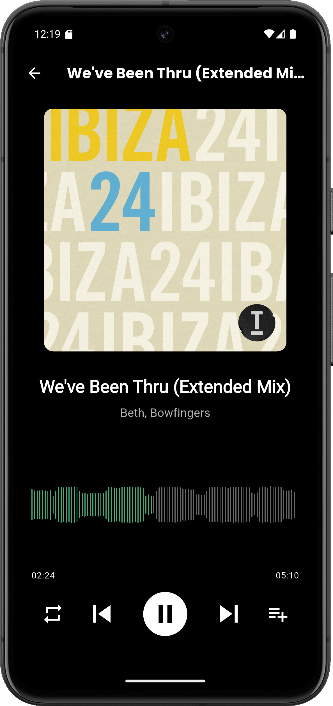

# 🎶 TravyPlay v0.9.5 Beta

> Il tuo media center personale, potente e unificato.

<div style="background-color:#000; padding:30px; border-radius:15px; color:#fff; font-family:Arial, sans-serif;">

<div align="center">
    <table>
        <tr>
            <td></td>
            <td></td>
            <td>
                <br>
                
            </td>
            <td></td>
            <td></td>
        </tr>
    </table>
</div>

---

## 📖 Descrizione
**TravyPlay** è un media player open-source costruito in **Flutter**, progettato per unificare la tua libreria multimediale locale (musica, film, serie TV) e le tue liste **IPTV** in un'unica interfaccia elegante e facile da usare.

L'obiettivo è offrire un'esperienza fluida e centralizzata per godersi tutti i propri contenuti, senza dover passare da un'app all'altra.

---

<div style="display:flex; flex-wrap:wrap; gap:40px;">

<div style="flex:1; min-width:300px;">
## ✨ Funzionalità Principali

<table>
    <tr>
        <td></td>
        <td>
            <strong>🎵 Gestione Musica</strong><br>
            Scansiona automaticamente i file musicali presenti sul dispositivo.<br>
            Organizza la libreria per genere, artista e album.<br>
            Crea e gestisci le tue playlist personalizzate.
        </td>
    </tr>
    <tr>
        <td></td>
        <td>
            <strong>🎬 Libreria Video</strong><br>
            Raggruppa film e serie TV in raccolte intelligenti.<br>
            Naviga facilmente tra i tuoi contenuti video.
        </td>
    </tr>
    <tr>
        <td></td>
        <td>
            <strong>📺 Supporto IPTV</strong><br>
            Aggiungi sorgenti M3U personalizzate tramite link o file locali.<br>
            Sfoglia i canali per nazione o categoria.<br>
            Goditi la TV in streaming direttamente nell'app.
        </td>
    </tr>
</table>
</div>

<div style="flex:1; min-width:250px; border-left:2px solid #555; padding-left:20px;">
## 🚀 Funzioni Secondarie

- ⭐ **Preferiti Unificati**  
  Contrassegna come preferiti film, serie TV o canali IPTV per accedervi rapidamente.

- 🎶 **Playlist Musicali**  
  Crea, modifica e gestisci playlist musicali personalizzate per organizzare i tuoi brani preferiti.

- 🔍 **Ricerca Potente**  
  Trova ciò che cerchi in un attimo grazie a una ricerca veloce che filtra i risultati in tempo reale.

- 🔄 **Sincronizzazione Automatica**  
  Mantieni la tua libreria sempre aggiornata. L'app rileva automaticamente i nuovi file multimediali all'avvio.

- 📱 **Cross-Platform**  
  Scritto in Flutter per un'esperienza nativa e performante sia su Android che su iOS. (VERSIONE IOS NON ANCORA DISPONIBILE)
</div>

</div>

---

## ⚠️ Stato del Progetto: Beta
Attenzione: **TravyPlay è attualmente in versione 0.9.5 Beta**.  
Questo significa che l'app è in fase di sviluppo attivo e, sebbene sia ampiamente funzionale, potrebbero esserci bug o comportamenti inattesi.

Il tuo feedback è fondamentale in questa fase!  
👉 Se trovi un errore o hai un suggerimento, apri una [Issue](../../issues) su GitHub.

---

## 🚀 Installazione

Per ora, è possibile testare l'app da **sorgente:**  

```bash
# Clona il repository
git clone https://github.com/TUO_USERNAME/travyplay.git

# Entra nella directory
cd travyplay

# Installa le dipendenze
flutter pub get

# Avvia l'app
flutter run

