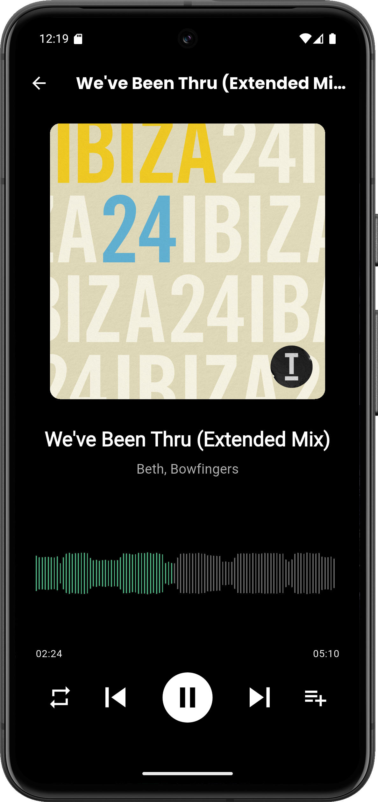
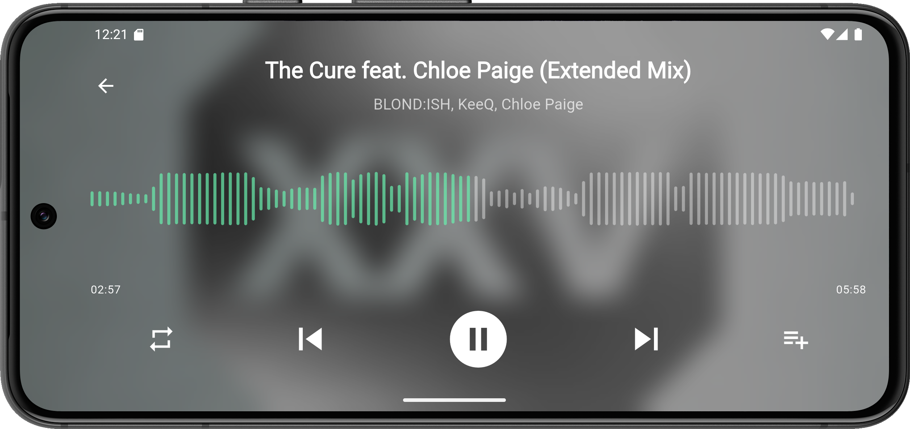
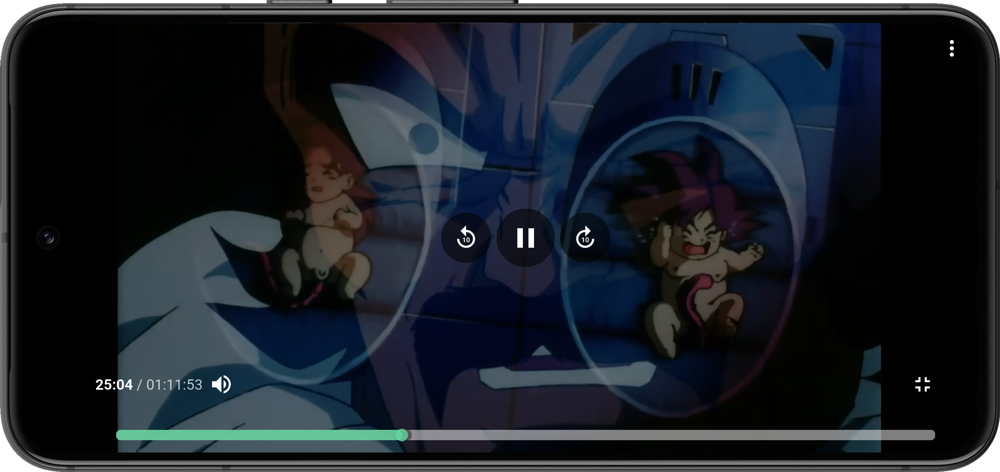
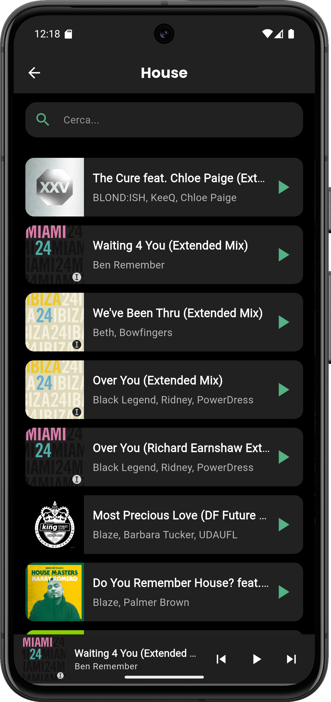
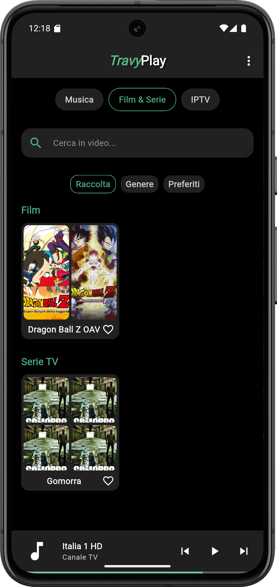
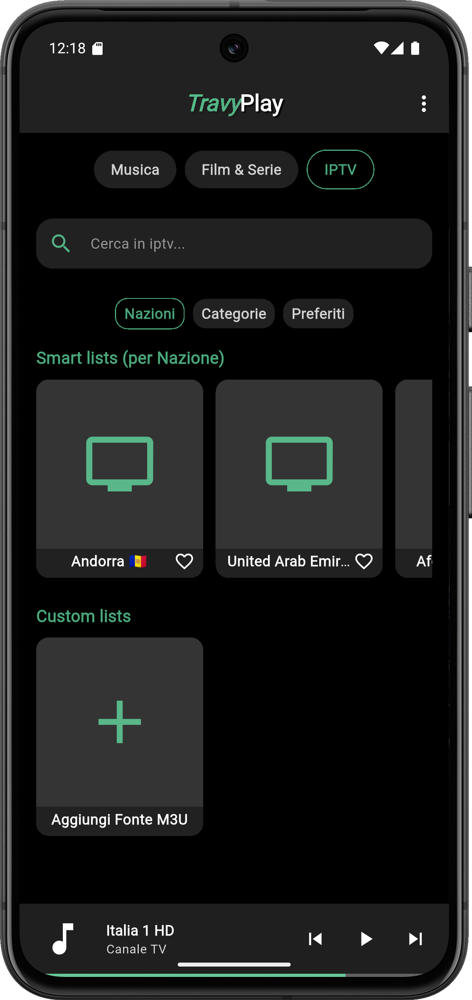
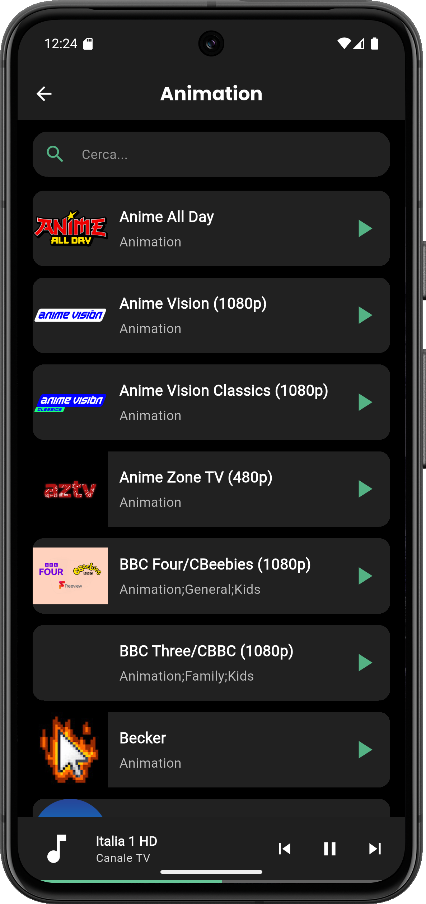

<!-- Stile globale per sfondo nero e testo bianco -->

# 🎶 TravyPlay

> Il tuo media center personale, potente e unificato.

---

<h2 style="margin-top:10px; color:#fff;">🚀 TravyPlay v0.9.5 Beta</h2>

<em>Un unico hub per musica, film, serie TV e IPTV.  Elegante. Centralizzato. Potente.</em>

  
  
  

---

### 📸 Anteprima

<table>
  <tr>
    <td></td>
    <td>
       
      
    </td>
    <td></td>
  </tr>
</table>

---

<table>
  <tr>
## 📖 Descrizione
**TravyPlay** è un media player open-source costruito in **Flutter**, progettato per unificare:  
- Libreria **musicale locale** 🎵  
- Collezione di **film e serie TV** 🎬  
- Liste e canali **IPTV** 📺  

Il tutto in **un’unica interfaccia moderna e semplice da usare**, pensata per sostituire più app con una sola soluzione.
  <tr>
    <table>
---

## ✨ Funzionalità Principali
<table>
  <tr>
    <td></td>
    <td style="color:#fff;">
      <strong>🎵 Gestione Musica</strong> 
      Scansione automatica dei file audio. 
      Libreria organizzata per genere, artista e album. 
      Creazione e gestione playlist personalizzate.
    </td>
  </tr>
  <tr>
    <td></td>
    <td style="color:#fff;">
      <strong>🎬 Libreria Video</strong> 
      Collezioni intelligenti di film e serie. 
      Navigazione fluida tra i contenuti video.
    </td>
  </tr>
  <tr>
    <td></td>
    <td style="color:#fff;">
      <strong>📺 Supporto IPTV</strong> 
      Aggiunta sorgenti M3U (link o file locali). 
      Canali organizzati per nazione o categoria. 
      Streaming TV integrato.
    </td>
  </tr>
</table>

## 🚀 Funzioni Secondarie

  
- ⭐ **Show Preferiti** – Accesso rapido a film, serie o canali IPTV.  
- 🎶 **Playlist Musicali** – Gestione lista brani personalizzata.  
- 🔍 **Ricerca Potente** – Filtri veloci e risultati in tempo reale.  
- 🔄 **Sincronizzazione Automatica** – Libreria sempre aggiornata.  
- 📱 **Cross-Platform** – Android e presto iOS. *(iOS non ancora disponibile)*
- 

<table>
  <tr>
    <td></td>
    <td></td>
  </tr>
</table>

---

## 🌟 Highlights

✅ Unifica Musica + Video + IPTV in un’unica app 
✅ Interfaccia moderna e fluida (Flutter) 
✅ Gratuito & Open Source 
✅ Ottimizzato per mobile

---

## ⚠️ Stato del Progetto

**Versione attuale:** `0.9.5 Beta` 
👉 L’app è stabile ma ancora in sviluppo attivo. Alcune funzioni potrebbero cambiare o migliorare.

---

## 📅 Roadmap (Prossimi Step)

- [ ] Integrazione con **Open Library (Internet Archive) API's** per ricerca, lettura, download di Libri 📚 
- [ ] Finalizzazione **versione iOS** 
- [ ] Rilascio su **Android / IOS**  

---

 

    

