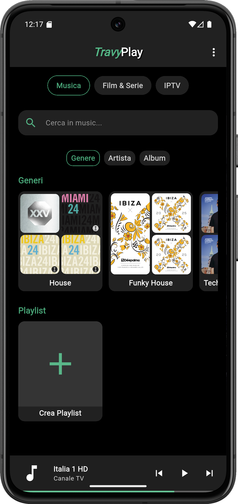

## 📖 Descrizione

**TravyPlay** è un media player open-source costruito in **Flutter**, progettato per unificare:  

- Libreria **musicale locale** 🎵 
- Collezione di **film e serie TV** 🎬 
- Liste e canali **IPTV** 📺  

Il tutto in **un’unica interfaccia moderna e semplice da usare**, pensata per sostituire più app con una sola soluzione.

<table style="width:100%; border-spacing:0 0;">
  <tr>
    <td style="width:60%; vertical-align:top;">
      <h2 style="margin-top:0; text-align:left;">✨ Funzionalità Principali</h2>
      <table style="width:100%; border-spacing:0 20px;">
        <tr>
          <td style="width:130px; vertical-align:top;">
            
          </td>
          <td style="vertical-align:top; padding-left:10px;">
            <strong>🵠Gestione Musica</strong> 
            Scansione automatica dei file audio. 
            Libreria organizzata per genere, artista e album. 
            Creazione e gestione playlist personalizzate.
          </td>
        </tr>
        <tr>
          <td style="width:130px; vertical-align:top;">
            
          </td>
          <td style="vertical-align:top; padding-left:10px;">
            <strong>🬠Libreria Video</strong> 
            Collezioni intelligenti di film e serie. 
            Navigazione fluida tra i contenuti video.
          </td>
        </tr>
        <tr>
          <td style="width:130px; vertical-align:top;">
            
          </td>
          <td style="vertical-align:top; padding-left:10px;">
            <strong>📺 Supporto IPTV</strong> 
            Aggiunta sorgenti M3U (link o file locali). 
            Canali organizzati per nazione o categoria. 
            Streaming TV integrato.
          </td>
        </tr>
      </table>
    </td>
    <td style="width:40%; vertical-align:top;">
      <h2 style="margin-top:0; text-align:right;">🚀 Funzioni Secondarie</h2>
      <ul style="font-size:1.05em; margin-bottom:30px; text-align:right;">
        <li><strong>⭐ Show Preferiti</strong> – Accesso rapido a film, serie o canali IPTV.</li>
        <li><strong>🎶 Playlist Musicali</strong> – Gestione lista brani personalizzata.</li>
        <li><strong>🔍 Ricerca Potente</strong> – Filtri veloci e risultati in tempo reale.</li>
        <li><strong>🔄 Sincronizzazione Automatica</strong> – Libreria sempre aggiornata.</li>
        <li><strong>📱 Cross-Platform</strong> – Android e presto iOS. (iOS non ancora disponibile)</li>
      </ul>
      

        <table style="margin:auto; border-spacing:10px 0;">
          <tr>
            <td></td>
            <td></td>
          </tr>
        </table>
      

    </td>
  </tr>
</table>

## 🌟 Highlights
✅ Unifica Musica + Video + IPTV in un’unica app 
✅ Interfaccia moderna e fluida (Flutter) 
✅ Gratuito & Open Source 
✅ Ottimizzato per mobile

## ⚠️ Stato del Progetto
**Versione attuale:** `0.9.5 Beta` 
👉 L’app è stabile ma ancora in sviluppo attivo. Alcune funzioni potrebbero cambiare o migliorare.

## 📅 Roadmap (Prossimi Step)
<ul class="roadmap">
<li>Integrazione con **Open Library (Internet Archive) API's** per ricerca, lettura, download di Libri 📚</li>
<li>Finalizzazione **versione iOS**</li>
<li>Rilascio su **Android / IOS**</li>
</ul>

    

